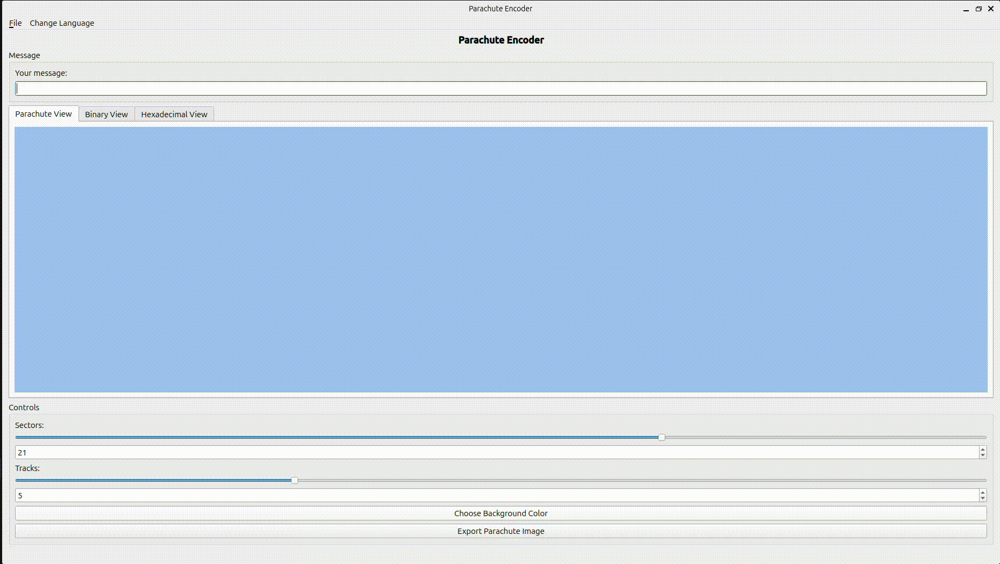

# Qt-ParachuteEncoder


---

## Project Overview

ParachuteEncoder is a **Qt-based application** designed to encode messages into a visual representation inspired by the parachute used during the landing of the Perseverance rover on Mars. The parachute's design contained a hidden binary message, and this project replicates that concept by allowing users to encode their own messages into a parachute-like visualization.


<div align="center">
    
</div>

The project follows the **Model-View-Presenter (MVP)** architectural pattern, ensuring a clear separation of concerns between the data (Model), user interface (View), and logic (Presenter).

---

## Context and Objective

The idea for this project is inspired by the **Perseverance rover's parachute**, which carried a hidden binary message during its landing on Mars. This project allows users to:
- Encode a custom message into a binary format.
- Visualize the binary message as a parachute design with customizable sectors and tracks.
- Export the parachute visualization as an image.
- Save and load encoded messages and parachute parameters.

The application is multilingual, supporting English, French, and Arabic, and provides an intuitive graphical interface for users to interact with.

---

## Features

1. **Message Encoding**:
   - Converts user-provided text into a binary format using ASCII encoding.
   - Displays the binary representation in a grid format.

2. **Parachute Visualization**:
   - Visualizes the binary message as a parachute design with customizable sectors and tracks.
   - Allows users to change the background color of the parachute.

3. **Hexadecimal View**:
   - Displays the hexadecimal representation of the encoded message.
   - Dynamically updates as the message changes.
   - Provides a clean and readable format for users who prefer hexadecimal over binary.

4. **Export Functionality**:
   - Exports the parachute visualization as a PNG image.

5. **Save and Load**:
   - Saves the message and parachute parameters to a custom `.ep` file format.
   - Loads previously saved `.ep` files to restore the message and visualization.

6. **Multilingual Support**:
   - Supports English, French, and Arabic languages.
   - Users can switch languages dynamically through the menu.

---

## Project Structure

The project is organized following the MVP architecture:

```
PARACHUTE/
├── vscode/ 
├── resources/ 
│   ├── translations/ 
│   │   ├── en.ts
│   │   ├── fr.ts
│   │   ├── ar.ts
│   │   ├── en.qm
│   │   ├── fr.qm
│   │   └── ar.qm
│   ├── Gif/
│   │   └── parachute.gif
│   └── resources.qrc
├── src/
│   ├── model/ 
│   │   ├── MessageEncoder.cpp
│   │   ├── MessageEncoder.h
│   │   ├── ParachuteModel.cpp
│   │   └── ParachuteModel.h
│   ├── presenter/
│   │   ├── ParachutePresenter.cpp
│   │   └── ParachutePresenter.h
│   └── view/
│       ├── MainWindow.cpp
│       ├── MainWindow.h
│       ├── ParachuteView.cpp
│       ├── ParachuteView.h
│       ├── BinaryWidget.cpp
│       ├── BinaryWidget.h
│       ├── HexView.cpp
│       └── HexView.h
├── CMakeLists.txt 
├── main.cpp 
└── README.md 
```

---

## How It Works

### Encoding Messages
1. Users input a message in the text box.
2. The message is encoded into binary using ASCII encoding.
3. The binary representation is displayed in a grid format in the **Binary View**.

### Parachute Visualization
1. The binary message is mapped onto a parachute design.
2. Users can customize the number of sectors and tracks in the parachute.
3. The parachute visualization updates dynamically as the message or parameters change.

### Hexadecimal View
1. The encoded message is converted into a hexadecimal format.
2. The hexadecimal representation is displayed in the **Hexadecimal View**.
3. The view dynamically updates as the message changes.
4. The hexadecimal format provides a compact and readable representation of the encoded message.

### Exporting and Saving
1. Users can export the parachute visualization as a PNG image.
2. Users can save the message and parachute parameters to a `.ep` file.
3. Saved files can be loaded to restore the message and visualization.

---

## Translations

### Generating Translation Files

To generate the `.qm` translation files, run the following commands:

```bash
lrelease resources/translations/en.ts resources/translations/fr.ts resources/translations/ar.ts
lupdate . -ts resources/translations/en.ts resources/translations/fr.ts resources/translations/ar.ts
```

### Editing Translations

To edit the translations, open the `.ts` files in Qt Linguist:

```bash
linguist resources/translations/en.ts
linguist resources/translations/fr.ts
linguist resources/translations/ar.ts
```

---

## Building and Running the Project

### Prerequisites
- **Qt5**: Ensure that Qt5 is installed on your system.
- **CMake**: Ensure that CMake is installed.

### Steps to Build and Run

1. Generate the UI header file:
   ```bash
   uic src/view/MainWindow.ui -o src/view/ui_MainWindow.h
   ```

2. Build the project:
   ```bash
   rm -rf build
   mkdir build && cd build
   cmake ..
   make
   ```

3. Run the application:
   ```bash
   ./ParachuteEncoder
   ```

---
### Professor
- **Karim-Eric Ziad**: karim-eric.ziad-forest@ensicaen.fr

##Contributors


### Students
- **ZOUGGARI Taha**: taha.zouggari@ensicaen.fr
- **KHALI Omar**: omar.khali@ensicaen.fr

---

## Future Improvements

1. **Advanced Encoding**:
   - Support for different encoding schemes (e.g., UTF-8, Base64).

2. **Customizable Colors**:
   - Allow users to customize the colors of the parachute sectors.

3. **Interactive Visualization**:
   - Enable users to interact with the parachute visualization (e.g., click on sectors to toggle their state).

4. **Additional Languages**:
   - Add support for more languages beyond English, French, and Arabic.

5. **Improved File Format**:
   - Enhance the `.ep` file format to include metadata such as creation date and author.

---

## License

This project is licensed under the MIT License. Feel free to use, modify, and distribute the code as needed.
