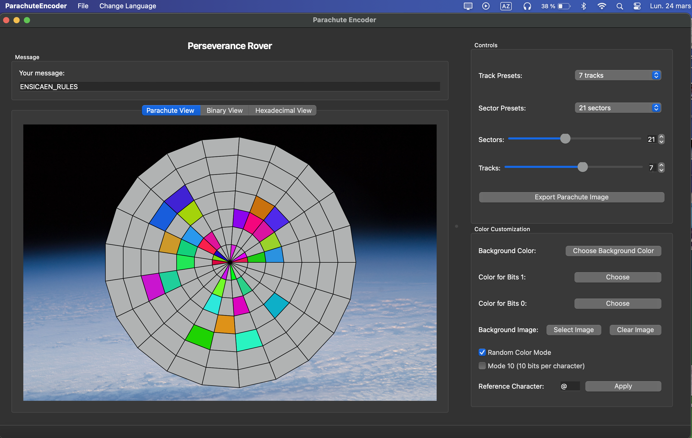

# Qt-ParachuteEncoder


---

## Project Overview

ParachuteEncoder is a **Qt-based application** designed to encode messages into a visual representation inspired by the parachute used during the landing of the Perseverance rover on Mars. The parachute's design contained a hidden binary message, and this project replicates that concept by allowing users to encode their own messages into a parachute-like visualization.


<div align="center">
    
</div>

The project follows the **Model-View-Presenter (MVP)** architectural pattern, ensuring a clear separation of concerns between the data (Model), user interface (View), and logic (Presenter).

---

## Context and Objective

The idea for this project is inspired by the **Perseverance rover's parachute**, which carried a hidden binary message during its landing on Mars. This project allows users to:
- Encode a custom message into a binary format.
- Visualize the binary message as a parachute design with customizable sectors and tracks.
- Export the parachute visualization as an image.
- Save and load encoded messages and parachute parameters.

The application is multilingual, supporting English, French, and Arabic, and provides an intuitive graphical interface for users to interact with.

---

## Features

1. **Message Encoding**:
   - Converts user-provided text into a binary format using ASCII encoding.
   - Displays the binary representation in a grid format.
   - Supports two encoding modes: standard (7 bits) and Mode 10 (10 bits per character, 7 bits + 3 blancs).
   - Allows users to customize the reference character (the character considered as zero, '@' by default).

2. **Parachute Visualization**:
   - Visualizes the binary message as a parachute design with customizable sectors and tracks.
   - Allows users to customize both background color and colors for bits (1 and 0).
   - Supports using a custom image as background for creative designs.
   - Provides a random color mode for bits 1 for creative visualizations.
   - Offers preset selections for multiples of 7 (standard mode) or multiples of 10 (Mode 10).

3. **Hexadecimal View**:
   - Displays the hexadecimal representation of the encoded message.
   - Dynamically updates as the message changes.
   - Provides a clean and readable format for users who prefer hexadecimal over binary.

4. **Export Functionality**:
   - Exports the parachute visualization as a PNG image.

5. **Save and Load**:
   - Saves the message, parachute parameters, and mode settings to a custom `.ep` file format.
   - Loads previously saved `.ep` files to restore the message, visualization, and mode settings.

6. **Multilingual Support**:
   - Supports English and French languages.
   - Users can switch languages dynamically through the menu.

7. **Enhanced User Interface**:
   - Two-panel design with the main area (70%) dedicated to parachute visualization.
   - Side panel (30%) with organized controls grouped by function.
   - Scrollable control panel for better usability on smaller screens.
   - Tab-based visualization selection between parachute, binary, and hexadecimal views.

## Implemented Requirements

All strongly suggested features have been successfully implemented:

1. **Message Management via Model Class**:
   - The message is managed by a model class that provides access to individual bits of the message.
   - Follows the Model-View-Presenter (MVP) pattern for clean architecture.

2. **Adjustable Parachute Parameters**:
   - The number of sectors can be adjusted using both a slider and a spinbox.
   - The number of concentric circles ("tracks") can be adjusted using both a slider and a spinbox.
   - Preset options available for quick configuration.

3. **Multiple Views**:
   - "Parachute View" with circular visualization of the encoded message.
   - "Binary View" showing the grid representation of the binary message.
   - "Hexadecimal View" for a compact representation of the message.

4. **Standard Interface Elements**:
   - Complete with standard menus, actions, and keyboard shortcuts.
   - Intuitive user interface with logically organized controls.

5. **Multilingual Support**:
   - Interface translation available in multiple languages (English, French).
   - Language can be changed dynamically through the menu.

6. **File Operations**:
   - Save functionality for text and parachute parameters in a custom file format (.ep).
   - Load functionality to restore saved parameters and message.
   - Export parachute visualization as an image.

7. **Additional Enhancements**:
   - Custom reference character selection, allowing users to define which character is considered as zero (default is '@').
   - Color customization for bits 0 and 1, with user-selectable colors for both elements.
   - Random color mode for bits with value 1, creating visually dynamic parachute designs.
   - Mode 10 support (7 bits + 3 blanks) as implemented in the original Perseverance rover parachute.
   - Sector selection among multiples of 7 (standard mode) or multiples of 10 (Mode 10) for easier configuration.
   - Background image support for creative designs and customization.
   - Modernized two-panel interface for improved user experience.
   - Additional visual improvements enhancing the overall application functionality.

## Additional Implemented Features

Beyond the strongly suggested features, several additional enhancements have been successfully implemented:

1. **Reference Character Customization**:
   - Users can change the reference character (the character considered as zero in the encoding).
   - By default, '@' is used as the reference, but any character can be selected.
   - The reference character change is dynamically applied to the visualization.

2. **Color Customization**:
   - Full control over the two colors used in the parachute visualization (for bits 0 and 1).
   - Color picker interface for intuitive selection.
   - Live preview of color changes.

3. **Random Color Mode**:
   - Optional random color mode for bits with value 1.
   - Creates visually interesting and unique parachute designs.
   - Can be toggled on/off at any time.

4. **Mode 10 Support**:
   - Implementation of the 10-segment blocks (7 bits + 3 blanks) as in the original Perseverance parachute.
   - Switch between standard mode and Mode 10 with a simple checkbox.
   - Automatic adjustment of sector presets based on the selected mode.

5. **Intelligent Sector Presets**:
   - Quick selection of sector counts from multiples of 7 (standard mode) or multiples of 10 (Mode 10).
   - Preset dropdown menu adapts based on the current encoding mode.
   - Simplifies configuration for optimal visualization.

6. **Background Customization**:
   - Option to use a custom background image instead of a solid color.
   - Support for various image formats (PNG, JPG, BMP).
   - Image scaling and positioning to fit the parachute view.

7. **Modern UI Design**:
   - Responsive two-panel layout with adjustable split.
   - Tab-based navigation between different visualization modes.
   - Organized controls grouped by function for intuitive use.

---

## Project Structure

The project is organized following the MVP architecture with an enhanced UI layout:

```
PARACHUTE/
├── include/
│   ├── model/
│   │   ├── MessageEncoder.h
│   │   └── ParachuteModel.h
│   ├── presenter/
│   │   └── ParachutePresenter.h
│   ├── utils/
│   │   └── LanguageManager.h
│   └── view/
│       ├── BinaryWidget.h
│       ├── HexView.h
│       ├── MainWindow.h
│       ├── ParachuteView.h
│       └── ui_MainWindow.h
├── src/
│   ├── model/
│   │   ├── MessageEncoder.cpp
│   │   └── ParachuteModel.cpp
│   ├── presenter/
│   │   └── ParachutePresenter.cpp
│   ├── utils/
│   │   └── LanguageManager.cpp
│   └── view/
│       ├── BinaryWidget.cpp
│       ├── HexView.cpp
│       ├── MainWindow.cpp
│       ├── MainWindow.ui
│       └── ParachuteView.cpp
├── resources/
│   ├── Gif/
│   │   └── parachute.gif
│   ├── icons/
│   │   ├── arabic.png
│   │   ├── binary.png
│   │   ├── color.png
│   │   ├── dark_mode.png
│   │   ├── down-arrow-white.png
│   │   ├── down-arrow.png
│   │   ├── english.png
│   │   ├── exit.png
│   │   ├── export.png
│   │   ├── french.png
│   │   ├── hex.png
│   │   ├── language.png
│   │   ├── light_mode.png
│   │   ├── open.png
│   │   ├── parachute.png
│   │   ├── save.png
│   │   └── settings.png
│   ├── translations/
│   │   ├── ar.qm
│   │   ├── ar.ts
│   │   ├── en.qm
│   │   ├── en.ts
│   │   ├── fr.qm
│   │   └── fr.ts
│   └── resources.qrc
├── CMakeLists.txt
├── main.cpp
└── README.md
```

---

## How It Works

### Encoding Messages
1. Users input a message in the text box.
2. The message is encoded into binary using ASCII encoding.
3. Users can choose between standard 7-bit encoding or Mode 10 (10 bits per character).
4. Users can customize the reference character (by default '@' is used as zero in the encoding).
5. The binary representation is displayed in a grid format in the **Binary View**.

### Parachute Visualization
1. The binary message is mapped onto a parachute design.
2. Users can customize the number of sectors and tracks in the parachute:
   - Choose from preset sector counts (multiples of 7 in standard mode, multiples of 10 in Mode 10)
   - Select track count from presets ranging from 3 to 10
3. Users can customize the colors and background:
   - Background color or custom background image
   - Color for bits 1 (parachute segments)
   - Color for bits 0 (sector segments)
   - Enable random color mode for bits 1
4. The parachute visualization updates dynamically as the message or parameters change.

### Hexadecimal View
1. The encoded message is converted into a hexadecimal format.
2. The hexadecimal representation is displayed in the **Hexadecimal View**.
3. The view dynamically updates as the message changes.
4. The hexadecimal format provides a compact and readable representation of the encoded message.

### Exporting and Saving
1. Users can export the parachute visualization as a PNG image.
2. Users can save the message, parachute parameters, mode settings, and background image path to a `.ep` file.
3. Saved files can be loaded to restore the message, visualization, mode settings, and background image.

---

## User Interface

The application uses a modern two-panel design:

1. **Main Panel (70% of width)**:
   - Message input at the top
   - Tab-based view selection (Parachute, Binary, Hexadecimal)
   - Large visualization area for better viewing experience

2. **Control Panel (30% of width)**:
   - Scrollable area containing all controls
   - Organized in logical groups:
     - Parachute parameters (sectors and tracks)
     - Preset selectors for quick configuration
     - Color customization options
     - Mode selection

Users can adjust the relative size of these panels using the splitter between them.

---

## Translations

### Generating Translation Files

To generate the `.qm` translation files, run the following commands:

```bash
lrelease resources/translations/en.ts resources/translations/fr.ts resources/translations/ar.ts
lupdate . -ts resources/translations/en.ts resources/translations/fr.ts resources/translations/ar.ts
```

### Editing Translations

To edit the translations, open the `.ts` files in Qt Linguist:

```bash
linguist resources/translations/en.ts
linguist resources/translations/fr.ts
linguist resources/translations/ar.ts
```

---

## Building and Running the Project

### Prerequisites
- **Qt5**: Ensure that Qt5 is installed on your system.
- **CMake**: Ensure that CMake is installed.

### Steps to Build and Run

1. Generate the UI header file:
   ```bash
   uic src/view/MainWindow.ui -o src/view/ui_MainWindow.h
   ```

2. Build the project:
   ```bash
   rm -rf build
   mkdir build && cd build
   cmake ..
   make
   ```

3. Run the application:
   ```bash
   ./ParachuteEncoder
   ```

---
### Professor
- **Karim-Eric Ziad**: karim-eric.ziad-forest@ensicaen.fr

## Contributors


### Students
- **ZOUGGARI Taha**: taha.zouggari@ensicaen.fr
- **KHALI Omar**: omar.khali@ensicaen.fr

---

## License

This project is licensed under the MIT License. Feel free to use, modify, and distribute the code as needed.
